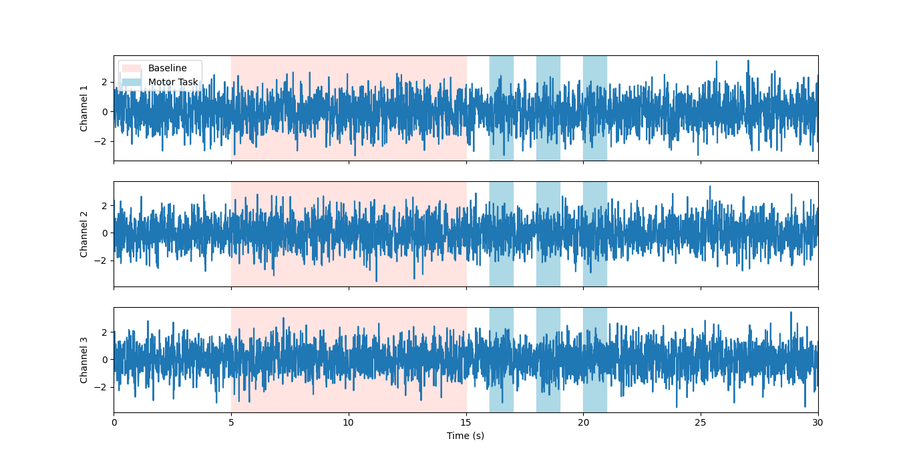
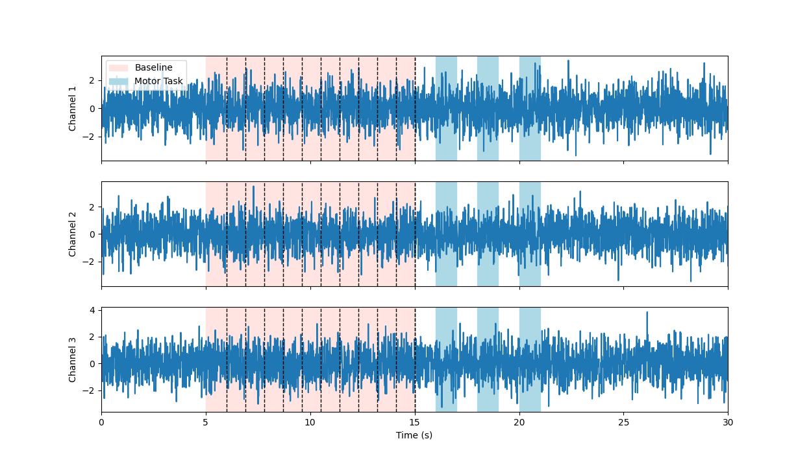

.. _epoch_timing:
Epoch Timing
############

What are Epochs?
----------------
Epochs are periods of time.

In relation to training models on set actions for brain computer interfaces, it is useful to define epochs by the amount of time-series data before and after a marker has been received. Once the data is sliced in to an epoch it may be processed for feature extraction, or in some cases passed as raw input, see :ref:`custom-extractor` and :ref:`raw-extractor` for more information on feature extraction.

Setting the :class:`PyBCI.globalEpochSettings` with the :class:`GlobalEpochSettings()` class  sets the target window length and overlap for the training time windows. It is desirable to have a singular global window length that all epcosh will be sliced into so then it is uniform when having a continuous rolling window of data when in testing mode.

.. _set_custom_epoch_times:
Setting Custom Epoch Times
------------------------

The figure below illustrates when you may have epochs of differing lengths received on the LSL marker stream. A baseline marker may signify an extended period, in this case 10 seconds, and our motor task is only 1 second long. To account for this set :class:`PyBCI.customEpochSettings` and :class:`PyBCI.globalEpochSettings` accordingly:

.. code-block:: python

   gs = GlobalEpochSettings()
   gs.tmax = 1 # grab 1 second after marker
   gs.tmin = 0 # grabs 0 seconds before marker
   gs.splitCheck = False # splits samples between tmin and tmax
   gs.windowLength = 1 # window length of 1 s
   gs.windowOverlap = 0.5 # windows overap by 50%, so for a total len
   baselineSettings = IndividualEpochSetting()
   baselineSettings.splitCheck = False
   baselineSettings.tmin = 0      # time in seconds to capture samples before trigger
   baselineSettings.tmax=  10      # time in seconds to capture samples after trigger
   bci = PyBCI(customEpochSettings=baselineSettings, globalEpochSettings=gs)

Highlighting these epochs on some psuedo emg data looks like the following:

.. _nosplitExample:

Overlapping Epoch Windows
------------------------

By setting splitCheck to True for ``baselineSettings.splitCheck`` and ``gs.windowOverlap`` to 0 we can turn one marker into 10 epochs, shown below:

.. _nooverlapExample:

   
   
By setting ``gs.windowOverlap`` to 0.5 we can turn overlap our 1 second epochs by 50% giving us 19 (2n-1) epochs, shown below:

.. _overlapExample:

.. image:: ../Images/splitEpochs/example1split50.png
   :target: https://github.com/LMBooth/pybci/blob/main/docs/Images/splitEpochs/example1split50.png
   
   
Debugging Timing Errors
------------------------
When initialising the :class:`PyBCI()` class we can set ``logger`` to “TIMING” to time the classification testing and training time and the feature extraction time for eah data inlet. These are the most computationally intensive tasks and will induce the most lag in the the system, make sure they are both shorter then ``globalEpochSettings.windowLength*(1-globalEpochSettings.windowOverlap)``.
