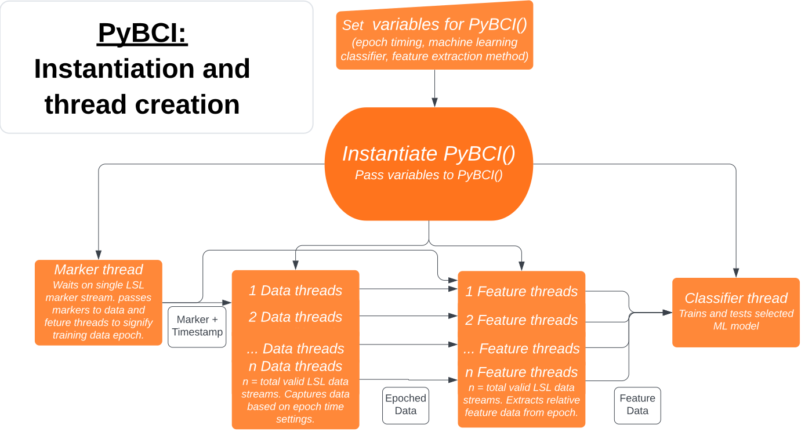

Theory of Operation
############

Requirements Prior Initialising with `bci = PyBCI()`
=========================================================
The bci must have ==1 LSL marker stream selected and >=1 LSL data stream/s selected - if more then one LSL marker stream is on the system it is recommended to set the desired ML training marker stream with :class:`markerStream` to  :py:class:`PyBCI()`, otherwise the first in list is selected. If no set datastreams are selected with :class:`dataStream` to :py:class:`PyBCI()` all available datastreams will be used and decoded with the :ref:`generic-extractor`.

Thread Creation
=========================================================
Once configuration settings are set 4 types of threaded operations are created; one classifier, one marker thread, with a feature and a data thread for each accepted LSL datastream.

Marker Thread
**********************************************
The marker stream has its own thread which recieves markers from the target LSL marker stream and when in train mode, the marker thread pushed the marker to all available data threads informing when to slice the data, see :ref:`set_custom_epoch_times`. Set the desired ML training marker stream with :class:`markerStream` to  :py:class:`PyBCI()`.

Data Threads
**********************************************
Each data stream has two threads created, one data and one feature extractor. The data thread is responsible for setting pre-allocated numpy arrays for each data stream inlet which pulls chunks of data from the LSL. When in training mode it gathers data so many seconds before and after a marker to prepare for feature extraction, with the option of slicing and overlapping so many seconds before and after the marker appropriately based on the classes `GlobalEpochSettings <https://github.com/LMBooth/pybci/blob/main/pybci/Configuration/EpochSettings.py>`_  and `IndividualEpochSettings <https://github.com/LMBooth/pybci/blob/main/pybci/Configuration/EpochSettings.py>`_, set with :class:`globalEpochSettings` and :class:`customEpochSettings` when initialising :py:class:`PyBCI()`.

Add desired dataStreams by passing a list of strings containing accepted data stream names with :class:`dataStreams`. By setting :class:`dataStreams` all other data inlets will be ignored except those in the list.

Note: Data so many seconds before and after the LSL marker timestamp is decided by the corresponding LSL data timestamps. If the LSL data stream pushes chunks infrequently (>[windowLength*(1-windowOverlap)]) and doesn't overwrite each sample with linear equidistant timestamps errors in classification output will occur - Kept legacy data threads AsyncDataReceiver and DataReceiver in threads folder in case modifications needed based on so many samples before and after decided by expected sample rate if people find this becomes an issue for certain devices.

Feature Extractor Threads
**********************************************
The feature extractor threads receive data from their corresponding data thread and prepares epoch data for re-unification in the classification thread with other devices in the same epoch.

The feature extraction techniques used can vary drastically between devices, to resolve this custom classes can be created to deal with specific stream types and passed to :class:`streamCustomFeatureExtract` when initialising  :py:class:`PyBCI()`, discussed more in :ref:`custom-extractor`.

The default feature extraction used is :ref:`GenericFeatureExtractor` found in `FeatureSettings.py <https://github.com/LMBooth/pybci/blob/main/pybci/Utils/FeatureExtractor.py>`_, with :ref:`GeneralFeatureChoices` found in `FeatureSettings.py <https://github.com/LMBooth/pybci/blob/main/pybci/Configuration/FeatureSettings.py>`_, see :ref:`generic-extractor` for more details.

Classifier Thread
**********************************************
The Classifier thread is responsible for receiving data from the various feature extraction threads, synchronising based on the number of data streams, then using the features and target marker values for testing and training the selected machine learning pytorch, tensorflow or scikit-learn model or classifier. 

If a valid marker stream and datastream/s are available :py:class:`PyBCI()` can start machine learning training by calling :func:`TrainMode()`. In training mode strings are received on the selected LSL marker stream which signify a machine learning target value has occured. A minimum number of each type of string type are required before classification beings, which can be modied with :class:`minimumEpochsRequired` to :py:class:`PyBCI()` on initialisation. Only after this number has been received of each and a suitable classification accuracy has been obtained should the bci start test mode. Call :func:`TestMode()` on the :py:class:`PyBCI()` object to start testing the machine learning model.

Once in test mode the data threads continuously slice time windows of data based on :class:`globalEpochSettings.windowLength` and optionally overlaps these windows according to :class:`globalEpochSettings.windowOverlap` when initialising :py:class:`PyBCI()`. These windows have features extracted the same as in test mode, then the extracted features are applied to the model/classifier to predict the current target. 

If the model is not performing well the user can always swap back to training model to gather more data with :func:`PyBCI.TestMode()`. It could also be worth to record your setup and view it in post to adjust yout epoch classifier timing windows accordingly. If the classifier output seem laggy look at :ref:`feature-debugging`, setting :class:`logger` to "TIMING" when initialising :class:`PyBCI()` prints classification testing and training times.

Custom Sci-Kit-Learn clf and Pytorch models can be used, see the examples found `here for sklearn <https://github.com/LMBooth/pybci/blob/main/pybci/Examples/testSklearn.py>`_, and  `here for PyTorch <https://github.com/LMBooth/pybci/blob/main/pybci/Examples/testPyTorch.py>`_.

Tensorflow can also be used `found here <https://github.com/LMBooth/pybci/blob/main/pybci/Examples/testTensorflow.py>`_, (Should be noted in PyBCI there is currently no suppression for tensorflow text prompts and the model training and tsting time can be substantially longer then pytorch and sklearn. Any recommendations are welcome in the issues on the git!)

Thread Overview
**********************************************
The figure below illustrates the general flow of data between threads on initialisation:

Another representation is given here for data flor operation between processes:

Testing and Training the Model
=========================================================

Training
**********************************************
Retrieiving current estimate
-----------------------------------------
Before the classifier can be run a minimum number of marker strings must be received for each type of target marker, set with the `minimumEpochsRequired` variable (default: 10) to :py:class:`PyBCI()`.

An sklearn classifier of the users choosing can be passed with the :ref:`clf` variable, Pytorch with :ref:'torchModel' or a tensorflow model with passed to :ref:`model` when instantiating with :py:class:`PyBCI()`, only one should be passed the others will default to :class:`None`.

The classifier performance or updated model/clf types can be queried by calling :func:`PyBCI.CurrentClassifierInfo()` example:

.. code-block:: python

   bci = PyBCI()
   classInfo = bci.CurrentClassifierInfo()

Where classInfo is a dict of:

.. code-block:: python

   classinfo = {
      "clf":self.classifier.clf,
      "model":self.classifier.model,
      "torchModel":self.classifier.torchModel,
      "accuracy":self.classifier.accuracy
   }

When in test mode data is captured :class:`tmin` seconds before the training marker and :class:`tmax` after the marker, if the :class:`splitCheck` otion is True then the epochs will be sliced up and overlapped set by the :class:`globalEpochSettings` :class:`windowLength` and :class:`overlap` options, see :ref:`set_custom_epoch_times` for more information and illustrations.

Testing
**********************************************
Retrieiving current estimate
-----------------------------------------------
When in test mode the data threads will continously pass time windows to the respective feature extractor threads. 

It is recommended to periodically query the current estimated marker with:

.. code-block:: python

    classGuess = bci.CurrentClassifierMarkerGuess()

where :class:`classGuess` is an integer relating to the marker value in the marker dict returned with :func:`PyBCI.ReceivedMarkerCount()`. See the :ref:`examples` for reference on how to setup sufficient training before switching to test mode and quering live classification esitmation. 

Resetting or Adding to Train mode Feature Data
-----------------------------------------------
The user can call :func:`PyBCI.TrainMode()` again to go back to training the model and add to the existing feature data with new LSL markers signifying new epochs to be processed.
