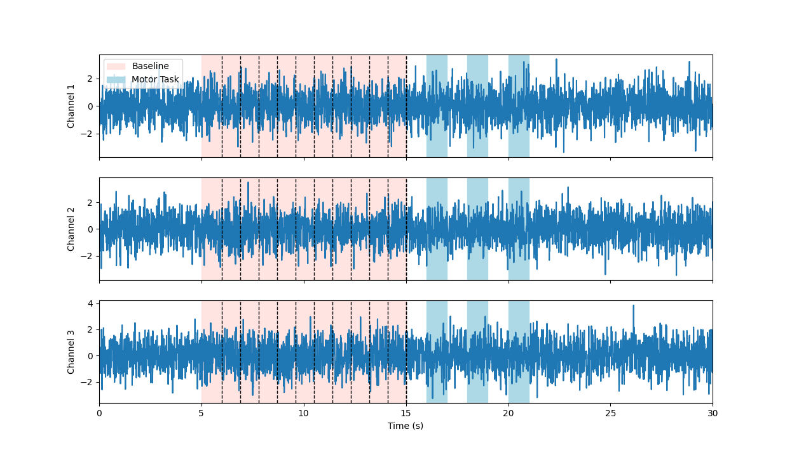

.. _epoch_timing:

Epoch Timing
############

What are Epochs?
----------------
Epochs are periods of time.

In relation to training models on set actions for brain computer interfaces, it is useful to define epochs by the amount of time-series data before and after a marker has been received indicating a desired classification action has been executed. A selected LSL marker stream is used to send strings which represent unique target training markers. Once data is sliced in to epochs it may be processed for feature extraction, or in some cases passed as raw time-series input, see :ref:`custom-extractor` and :ref:`raw-extractor` for more information on feature extraction.

Setting the :py:data:`globalEpochSettings` with the :class:`GlobalEpochSettings()` class sets the target window length and overlap for the training time windows. It is desirable to have a single global window length that all epochs are sliced to match, this gives a uniform array when passing to the classifier. When in testing mode a having a continuous rolling window of data is sliced to this size and overlapped based on the windowOverlap, see :ref:`set_custom_epoch_times` for more info.

.. _set_custom_epoch_times:

Setting Custom Epoch Times
--------------------------

The figure below illustrates when you may have epochs of differing lengths received on the LSL marker stream. A baseline marker may signify an extended period, in this case 10 seconds, and our motor task is only 1 second long. To account for this set :py:data:`customEpochSettings` and :py:data:`globalEpochSettings` accordingly, note the LSL Marker for baseline should match the key for the :py:data:`customEpochSettings` dict. NOTE: when using :py:data:`customEpochSettings` all epochs must be defined in the dict, other markers will be ignored, if :py:data:`customEpochSettings` is not used all markers on the selected marker stream will be used as a classification type:

.. code-block:: python

   gs = GlobalEpochSettings()
   gs.tmax = 1 # grab 1 second after marker
   gs.tmin = 0 # grabs 0 seconds before marker
   gs.splitCheck = False # splits samples between tmin and tmax
   gs.windowLength = 1 # window length of 1 s, means all marker timing windows will be 1 second long
   gs.windowOverlap = 0.5 # windows overap by 50%, so for a total len
   markerSettings = {}
   markerSettings["baseline"] = IndividualEpochSetting()
   markerSettings["baseline"].splitCheck = False
   markerSettings["baseline"].tmin = 0      # time in seconds to capture samples before trigger
   markerSettings["baseline"].tmax=  10      # time in seconds to capture samples after trigger
   markerSettings["Marker1"] = IndividualEpochSetting()
   markerSettings["Marker1"].splitCheck = False
   markerSettings["Marker1"].tmin = 0      # time in seconds to capture samples before trigger
   markerSettings["Marker1"].tmax=  1      # time in seconds to capture samples after trigger

   bci = PyBCI(customEpochSettings=markerSettings, globalEpochSettings=gs)

Highlighting these epochs on some psuedo emg data looks like the following:

.. _nosplitExample:

.. image:: ../Images/splitEpochs/example1.png
   :target: https://github.com/LMBooth/pybci/blob/main/docs/source/Images/splitEpochs/example1.png

Overlapping Epoch Windows
-------------------------

By setting splitCheck to True for :py:data:`markerSettings["baseline"].splitCheck` and :py:data:`gs.windowOverlap` to 0 we can turn one marker into 10 epochs, shown below:

.. _nooverlapExample:

   
   
By setting :py:data:`gs.windowOverlap` to 0.5 we can overlap 1 second epochs by 50% yielding 19 (2n-1) epochs, shown below:

.. _overlapExample:

   
   
Debugging Timing Errors
-----------------------
When initialising the :class:`PyBCI()` class set :py:data:`loggingLevel` to “TIMING” to time the feature extraction time for each data inlet as well as classification testing and training times. These are the most computationally intensive tasks and will induce the most lag in the the system. Each printed time must be shorter then :py:data:`globalEpochSettings.windowLength` * ( 1- :py:data:`globalEpochSettings.windowOverlap` ) to minimise delays from input data action to classification output.
